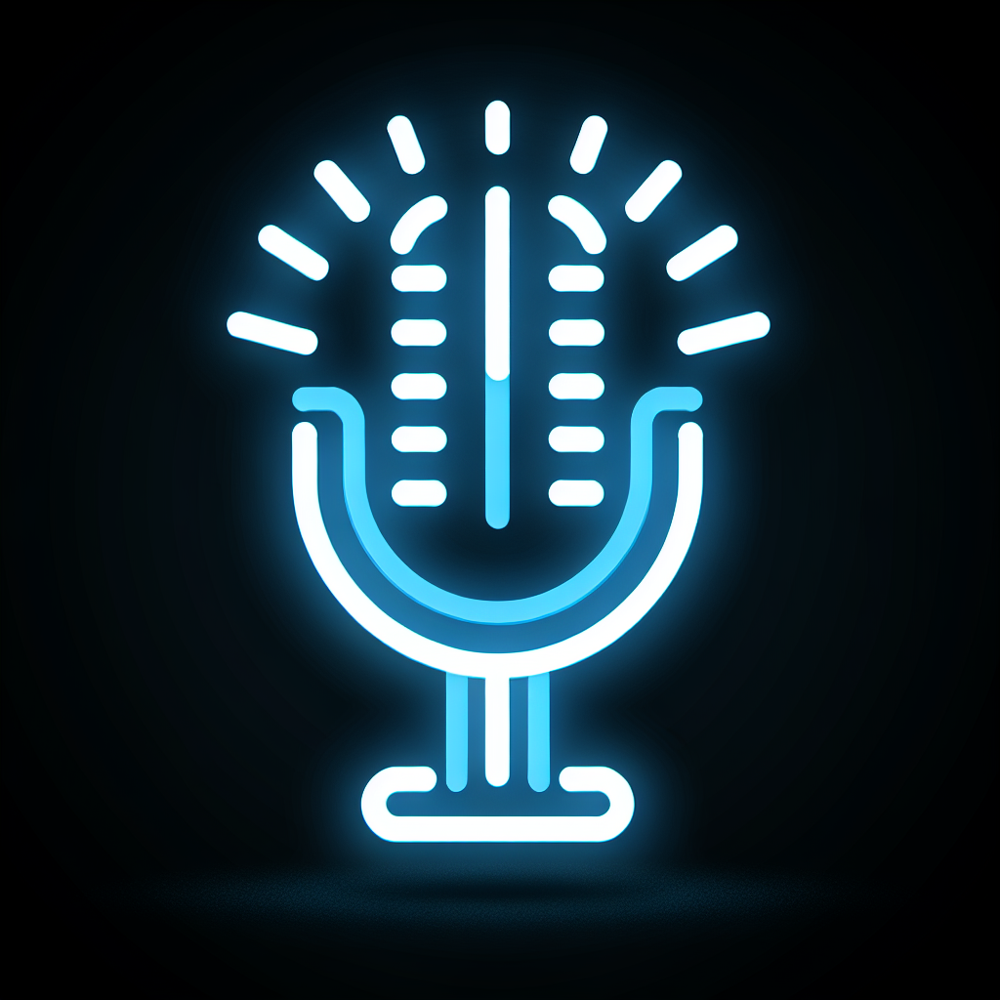

# HomeVoice Connect

A custom Home Assistant integration that provides an always-on, local wake word activated voice assistant using Google's Gemini Live API.

## Overview

HomeVoice Connect transforms your Home Assistant setup into a powerful voice assistant that listens locally for a wake word, then uses Google's advanced Gemini Live API for natural language understanding and response generation.

### Key Features

- **Local Wake Word Detection**: Uses openWakeWord for efficient, privacy-focused wake word detection that runs entirely on your Home Assistant server
- **Voice Activity Detection**: Smart detection of when you've finished speaking using WebRTC VAD
- **Gemini Live API Integration**: Leverages Google's advanced Gemini Live API for natural language understanding and responses
- **Flexible TTS Output**: Play responses through any media player entity in Home Assistant
- **Customizable Configuration**: Choose your wake word, sensitivity, audio devices, and TTS service
- **Privacy Focused**: Audio is only sent to Google after wake word detection and only for the duration of your command

## How It Works

1. **Wake Word Detection**: The system continuously listens locally for your chosen wake word (e.g., "Hey Computer")
2. **Audio Capture**: Once the wake word is detected, the system begins capturing your command and uses Voice Activity Detection to determine when you've finished speaking
3. **Gemini Processing**: Your command audio is sent to Google's Gemini Live API, which provides advanced language understanding and generates a response
4. **Response Playback**: The response is played back through your configured Home Assistant TTS service and media player

## Requirements

- Home Assistant installation with administrator access
- Microphone connected to your Home Assistant server
- Google Gemini API key (https://ai.google.dev/api/live)
- Media player entity in Home Assistant for response playback

## Installation

### HACS Installation (Recommended)

1. Open HACS in your Home Assistant instance
2. Go to "Integrations"
3. Click the three dots in the top right corner and select "Custom Repositories"
4. Add this repository URL with category "Integration"
5. Click "Install" on the HomeVoice Connect integration

### Manual Installation

1. Download this repository
2. Copy the `custom_components/homevoice_connect` directory to your Home Assistant `custom_components` directory
3. Restart Home Assistant

## Configuration

HomeVoice Connect can be configured through the Home Assistant UI:

1. Go to Settings → Devices & Services
2. Click "Add Integration" and search for "HomeVoice Connect"
3. Follow the configuration steps:
   - Enter your Gemini Live API Key
   - Select your preferred wake word
   - Configure wake word sensitivity
   - Select input device (microphone)
   - Select output device (media player)
   - Choose TTS service

## Supported Wake Words

The integration supports the following wake words through the openWakeWord library:

- "hey computer"
- "alexa"
- "ok google"
- "hey google" 
- "jarvis"
- "hey jarvis"
- "computer"
- "hey snapdragon"

## Dependencies

This integration requires the following Python libraries:

- openwakeword (0.4.0)
- webrtcvad (2.0.10)
- google-generativeai (0.3.1)
- numpy (1.20.0+)
- pyaudio (0.2.11+)
- sounddevice (0.4.5+)

These dependencies are automatically installed when you install the integration.

## Gemini Live API

This integration uses Google's Gemini Live API for advanced voice understanding. You need to:

1. Get an API key from [Google AI Studio](https://ai.google.dev/api/live)
2. Make sure your API key has access to Gemini Live features
3. Enter the API key in the integration settings

Note: This integration specifically uses Gemini Live API and not Google Assistant or other Google voice services.

## Privacy Considerations

- The wake word detection runs locally on your Home Assistant server
- Audio is only sent to Google's servers after the wake word is detected
- Audio is only sent for the duration of your command
- No continuous audio streaming to the cloud

## Troubleshooting

- **Wake word not detected**: Try increasing the sensitivity setting
- **Poor transcription**: Ensure your microphone is properly positioned and there's minimal background noise
- **No audio response**: Check that your selected media player entity is available and not in use by another application
- **API errors**: Verify your Gemini API key is valid and has sufficient quota

## License

This project is licensed under the MIT License - see the LICENSE file for details.

## Acknowledgments

- openWakeWord project for the wake word detection
- Google for the Gemini Live API
- Home Assistant community for inspiration and support

---

*Note: HomeVoice Connect is not affiliated with or endorsed by Google, Gemini, or Home Assistant.*